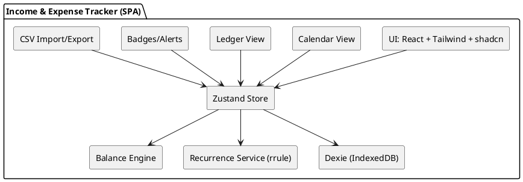
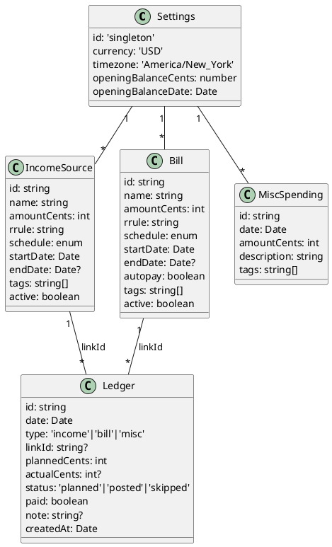
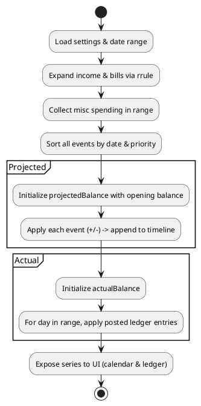

# SPEC-001 - Income & Expense Tracker

## Background

You want a lightweight personal finance tool focused on cash flow visibility rather than full accounting. The core needs are:

* Track recurring **income** (who/what, amount, schedule), and show **monthly totals**.
* Track recurring and one‑off **expenses/bills** with **due dates**, **amounts**, and a **Paid** checkbox.
* Maintain a **running balance** over time: start from a configurable opening balance, subtract scheduled bills on their due dates, and add income on its dates; reflect changes when a bill is marked Paid/Unpaid or when actual payments differ from planned.
* A **Misc Spending** log (date, amount, description) that immediately reduces the running balance.
* Present day‑by‑day and month‑by‑month views so you can see **projected** vs **actual** balances and quickly tell what’s due next.

Assumptions for the MVP (to be confirmed):

* Single user, manual data entry (no bank connections initially).
* Currency: USD; timezone: America/New\_York; month rollovers tracked by calendar month.
* Responsive web UI accessible from phone/desktop.

## Requirements

### Must Have

* **RQ-M1**: Manage income sources (add/edit/delete) with name, amount, schedule (one‑off, weekly, biweekly, monthly, twice‑monthly, custom day‑of‑month) and expected dates; show **monthly totals**.
* **RQ-M2**: Manage bills/expenses with name, amount, due date or recurrence, **Paid** checkbox, optional actual paid date/amount, and notes.
* **RQ-M3**: **Running balance engine**: user‑set opening balance; apply scheduled income (+) and bills (–) on their calendar dates; instantly reflect Paid/Unpaid toggles and Misc Spending; show **Projected vs Actual**.
* **RQ-M4**: **Misc Spending** log: date, amount, description; subtracts from balance immediately.
* **RQ-M5**: **Views**: Calendar (monthly) and Ledger/Timeline (sortable table) with today marker and current balance indicator.
* **RQ-M6**: **Responsive, mobile‑first UI** for modern mobile & desktop browsers; inline editing for speed.
* **RQ-M7**: **Local‑first persistence** (browser storage) with **Export/Import** (JSON/CSV) for backup.
* **RQ-M8**: Defaults: **USD**, **America/New\_York** timezone, 2‑decimal rounding, sensible validation.
* **RQ-M9**: Basic **accessibility** (keyboard nav, labels, focus states) and error states.

### Should Have

* **RQ-S1**: **Categories/Tags** for income & expenses; quick filters and search.
* **RQ-S2**: Recurring templates with skip/modify a single occurrence.
* **RQ-S3**: **Reminders** for upcoming bills (e.g., X days before): in‑app badges; optional email if enabled.
* **RQ-S4**: Simple **charts**: monthly cash‑in vs cash‑out; balance over time.
* **RQ-S5**: CSV import/export for income, bills, and misc spending.
* **RQ-S6**: Onboarding wizard to set opening balance and first items.
* **RQ-S7**: **Dark mode + modern/futuristic theme**.

### Could Have

* **RQ-C1**: Bank import (e.g., Plaid) – read‑only sync with manual review.
* **RQ-C2**: Multiple accounts (e.g., checking, savings) affecting one combined balance.
* **RQ-C3**: Category budgets/envelopes and alerts when nearing limits.
* **RQ-C4**: Private account & cloud sync for multi‑device use.
* **RQ-C5**: Attach receipts/images to entries.

### Won’t Have (MVP)

* **RQ-W1**: Multi‑user roles/teams.
* **RQ-W2**: Full double‑entry accounting or tax modules.
* **RQ-W3**: Investment/portfolio tracking.

### Non‑Functional

* **Performance**: common actions under 100 ms; support ≥5,000 entries without visible lag.
* **Privacy/Security**: local‑only by default; no analytics; any future sync is opt‑in and encrypted.
* **UX/Aesthetic**: super modern, futuristic, elite; minimal clicks; optimistic updates; undo for destructive actions.

## Method

### High-Level Architecture (Local‑first SPA)

* **Client‑only React app** (no backend for MVP) compiled with **Vite** and **TypeScript**.
* **Persistence**: Browser **IndexedDB** via **Dexie.js** for reliability and performance; export/import to JSON/CSV.
* **State**: **Zustand** store for simple, fast state management.
* **Scheduling/Recurrence**: **rrule** for generating occurrences (bills & income) from rules like monthly/biweekly.
* **Date/Time**: **Luxon** for timezone‑aware calculations (America/New\_York).
* **UI**: **Tailwind CSS v4** + **shadcn/ui** components + **Motion** (Framer Motion successor) for subtle animations; **lucide-react** icons.
* **Charts**: **Recharts** for cash‑in/out and balance lines.
* **PWA (optional)**: installable, offline by default; enabled later if desired.

### Data Model (store as integer cents)

> All amounts saved in **cents** to avoid floating‑point errors.

**Tables (IndexedDB/Dexie)**

* `settings`: `{ id: 'singleton', currency: 'USD', timezone: 'America/New_York', openingBalanceCents: number, openingBalanceDate: ISODate }`
* `income_sources`: `{ id, name, amountCents, rrule: string | null, schedule: 'oneoff'|'weekly'|'biweekly'|'monthly'|'twicemonthly'|'custom', startDate: ISODate, endDate?: ISODate, tags?: string[], active: boolean }`
* `bills`: `{ id, name, amountCents, rrule: string | null, dueDay?: number, schedule: same as above, startDate: ISODate, endDate?: ISODate, autopay?: boolean, tags?: string[], active: boolean }`
* `misc_spending`: `{ id, date: ISODate, amountCents, description, tags?: string[] }`  ← immediate impact
* `ledger`: `{ id, date: ISODate, type: 'income'|'bill'|'misc', linkId?: id, plannedCents: number, actualCents?: number, status: 'planned'|'posted'|'skipped', paid: boolean, note?: string, createdAt }`
* `tags`: `{ id, label }` (optional, for autocomplete)

**Notes**

* `ledger` holds both **planned** (projected) and **actual** postings. When you check **Paid**, we create/update a **posted** row with `actualCents`; projections remain for visibility.
* Recurrences are defined by `rrule` (e.g., `FREQ=MONTHLY;BYMONTHDAY=1`), or by simple presets mapped to rrule under the hood.

### Running Balance Engine

**Goal**: Produce **Projected** and **Actual** balances per day and a running balance after each event.

**Inputs**: opening balance, date range, expansions of income/bill recurrences, misc entries, and actual ledger postings.

**Algorithm (pseudocode)**

```
function buildTimeline(startDate, endDate):
  events = []
  for each income_source: events += expandOccurrences(income_source, range)
  for each bill: events += expandOccurrences(bill, range)
  for each misc_spending in range: events += { kind:'misc', date, amountCents: -amount }
  sort events by (date ASC, kindOrder)
  // kindOrder: income before bills before misc for deterministic balance when same day

  projectedBalance = openingBalanceAt(startDate)
  timeline = []

  for e in events:
    delta = (e.kind == 'income') ? +e.amountCents : -e.amountCents
    projectedBalance += delta
    timeline.push({ date:e.date, kind:e.kind, label:e.label, delta, projectedBalance })

  // Actual: overlay ledger postings
  actualBalance = openingBalanceAt(startDate)
  for day in each day between startDate..endDate:
    apply all ledger.posted on day to actualBalance
    record { day, actualBalance }

  return { timeline, projectedSeries: dailyFrom(timeline), actualSeries }
```

**Paid checkbox behavior**

* Toggle to **Paid** creates/updates a `ledger` row: `{status:'posted', paid:true, actualCents}` on that date.
* Unchecking (**not paid**) sets `paid:false` and can either delete the posted row or mark `status:'skipped'`.
* **Projected vs Actual** switch: Projected uses planned occurrences; Actual uses posted ledger only.

### Views & UX ("super modern, futuristic, elite")

* **Header bar**: current balance (Projected/Actual toggle), month selector, quick add buttons.
* **Month Calendar**: dots/badges for due/income; overdue bills highlighted; tap to open drawer for details.
* **Ledger View (default on mobile)**: virtualized list sorted by date with inline edit, Paid checkbox, and running balance column.
* **Misc Spending**: quick‑add pill at bottom; adds negative entry immediately.
* **Badges**: in‑app alerts for items due **today** and **next N days** (configurable, default 3).
* **Theme**: dark default with subtle glass surfaces, high‑contrast type, and micro‑interactions (Motion).

### Example Component Wiring

* `useStore` (Zustand): slices for settings, income, bills, misc, ledger, ui.
* `useBalance(range)` selector computes memoized projected/actual series.
* `RecurrenceService` wraps `rrule` to generate dates and handle exceptions/overrides.
* `DexieRepository` modules expose CRUD with schema migrations.

### PlantUML — Component Diagram



### PlantUML — Data Model (ER/Class Diagram)



### PlantUML — Running Balance Activity



### Reference Apps (for approach inspiration)

* **YNAB**: uses scheduled transactions and clear planning vs posting; we mirror the idea of **scheduled vs actual** but keep UI lighter.
* **Monarch Money / Rocket Money**: strong recurring detection and alerts; we adopt **in‑app reminders** without bank sync for MVP.

### Why this approach fits your needs

* **Crystal‑clear cash flow**: daily running balance with both **Projected** and **Actual**.
* **Speed**: local IndexedDB + memoized selectors keeps interactions instant, even with thousands of entries.
* **Elite UX**: dark, futuristic UI with smooth Motion animations and shadcn/ui components for clarity and polish.
